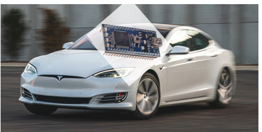

# Mbed Tesla

The Future of Awesome 
  

# Navigation 
- [Project Idea](#projectidea)  
- [Instructions](#instructions)  
- [Hardware](#hardware)  
- [Software](#software)  
- [Demo Video](#demo)

---
## Project Idea 
Bluetooth controlled mbed robot with similar functionality as a real car such as moving, turning, blinking lights, honking horn, and collision detection.

----
## Instructions 

Back to [Top](#top)!

----
## Hardware  

 

----
## Software   
**Pipelined MIPS Processor in Verilog**  
- Implemented pipelined MIPS processor that handles data, structural, and control hazards  with load-to-use stall, data forwarding, and branch prediction with flushing
- [source code](https://drive.google.com/drive/folders/1TNty7M6peybXFbq6Ig-HpSm_tmf9db-7?usp=sharing)

**Single-Cycle MIPS Processor in Verilog**  
- Implemented a single-cycle MIPS processor instructions with fetch, decode, execute, memory, writeback stages for assembly instructions (slt, j, jal, lui, ori)
- [source code](https://drive.google.com/drive/folders/1g00Eag3VHpeP1MRsrJ8K-g4yz4lYnVnp?usp=sharing)

Back to [Top](#top)!

----
## Demo Video 

[Chopin - Fantaisie Impromptu](https://www.youtube.com/watch?v=hCwSzsDiuXU)
  

Back to [Top](#top)!
