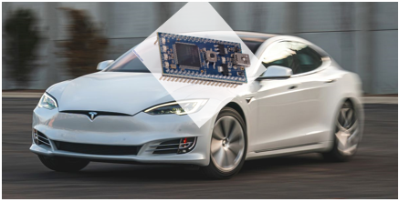

# Mbed Tesla

brought to you by David Gomez, Matthew Liu, & Adam Rappaport
  

# Navigation 
- [Project Idea](#projectidea)  
- [Instructions](#instructions)  
- [Hardware](#hardware)  
- [Software](#software)  
- [Demo Video](#demo)

---
## Project Idea 
Bluetooth controlled mbed robot with similar functionality as a real car such as moving, turning, blinking lights, honking horn, and collision detection.  

The robot will utilize the adafruit bluetooth app and module in order to be controlled. The robot will be able to be controlled for driving forwards, backwards, and turning. The robot will additionally have headlights and breaklights with different levels of brightness. The speaker can be controlled to honk. Additionally, the robot will feature a LIDAR sensor in the front that will prevent crashing into objects. All this functionality will be handled with mbed RTOS threads.  

----
## Instructions 
To recreate the project:  
1.  Build robot chassis with motors and attach breadboards as shown in pictures  
2.  Attach embed devices and wire appropriately according to [Hardware](#hardware)!   
3.  Compile and load source code onto main mbed and sonar mbed  
4.  Connect battery packs to circuit to power mbed  
5.  Connect via BlueFruit Connect on android/iphone  

----
## Hardware  
**Hardware and Comm Protocol Used**  
- LEDS: digital PWM pXX, pXX, pXX, pXX 
- SONAR: Trig p6, Echo p7   
- Bluetooth: RS232 Serial (Rx p27, Tx p28)  
- Speaker:  
- DC Motors:  

 

----
## Software  
**Code Snippets**  

  

  

**Full Source Code**  
- [source code main mbed](./assets/source_code.c)  
- [source code sonar mbed](./assets/source_code2.c)  

----
## Demo Video 

[Mbed Tesla Demo](https://clipchamp.com/watch/pJKSNSl9IBr)  

  

  

Back to [Navigation](#navi)!
